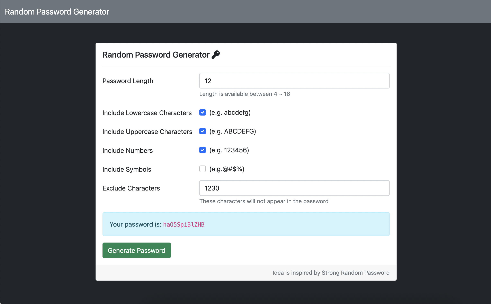

# Password Generator

## Introduction

A simple web tool to generate a random, high security password.

### Screenshot



## Features

- Users can input the password length they want
- Users can select the password whether include lowercase characters, uppercase characters, numbers, or symbols
- Users can input the characters they do not include in the password

## Installation

1. Make sure you do install Node.js and npm
2. Clone the repository to local
```https://github.com/Martina928/ac_exercise.git```
3. Enter the folder of the project through terminal
``` cd ac_exercise/2-3password_generator```
4. Run `npm install` to install associated dependencies
5. You will receive the message below when the connection is running successfully, then open the browser and go to the url
``` Password generator is listening on http://localhost:3000```
6. Run `ctrl + c` to stop the web app

## DevTools

- VS Code
- Express 4.18.2
- Express-Handlebars 3.0.0
